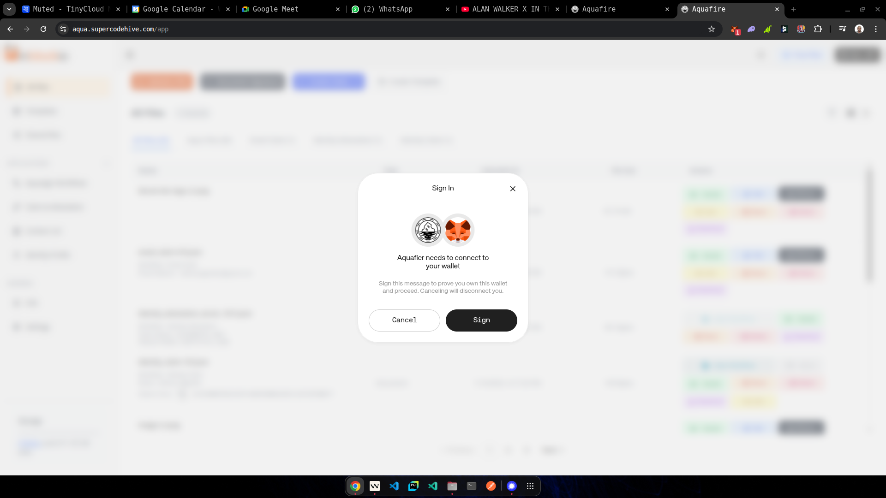
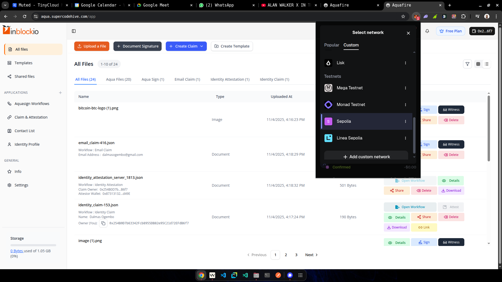
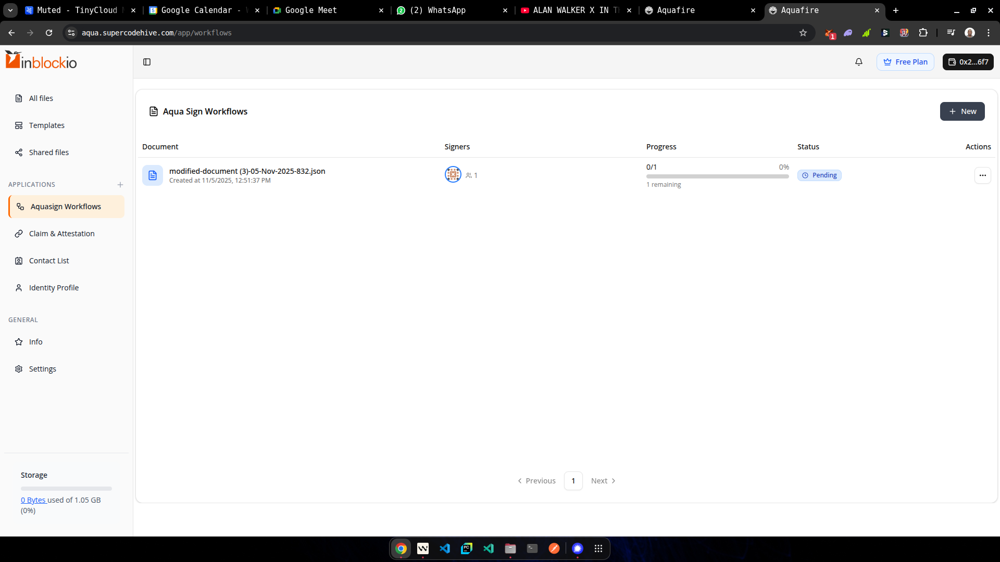
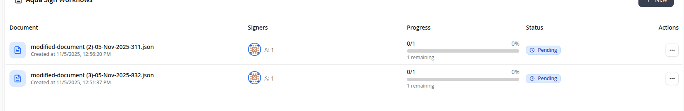
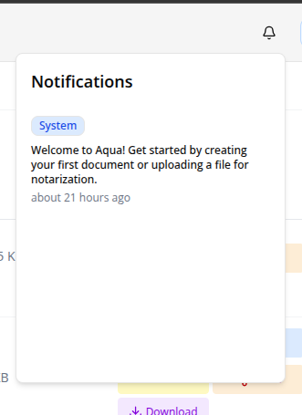
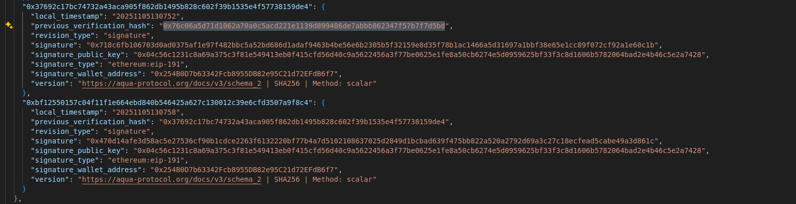
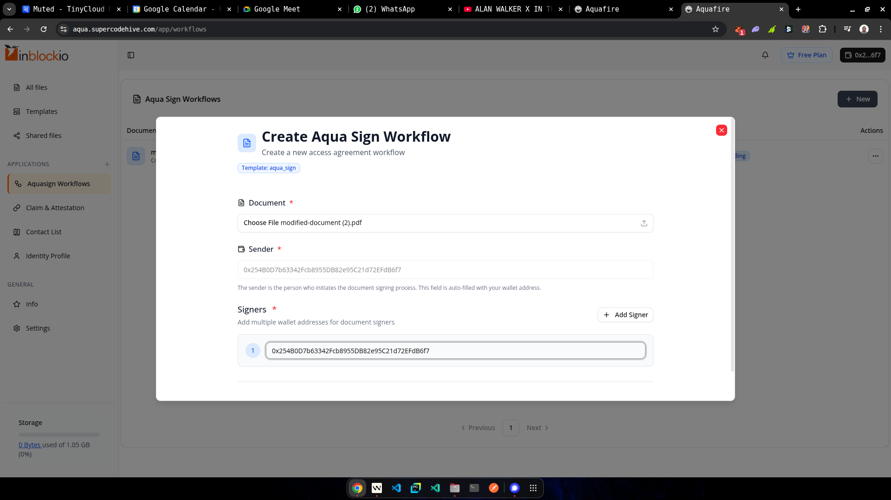
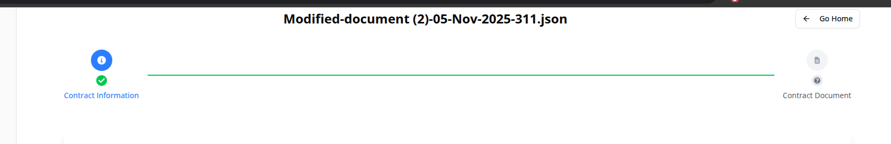
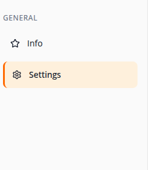
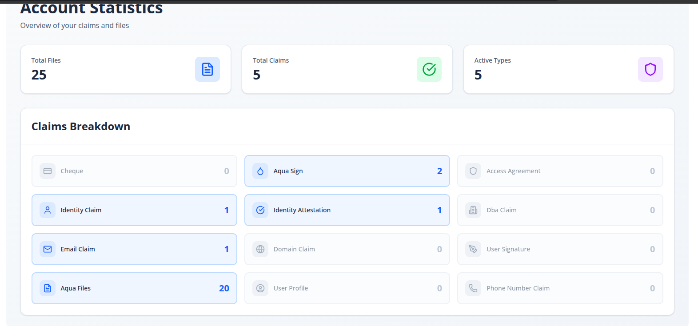

# Aquafier - Functional critical fixes

[ ] - 1. After login, if you refresh the page its asks you to sign in again
- The above issue is linked to the hardcoded value of the MAINNET network while the wallet might be in sepolia  - Critical

[ ] - 2. Enable reload after creation of workflows ie reload the page - The section where the file is for must be reloaded . Global section for reloads instead of local - Important
[ ] - 3.  - Clicking anywhere on aqua sign document should have same effect as "View document" - Important
[ ] - 4. Enable complete notifications in the sytem using websockets for different actions for a user ie if a new file is shared for a given address ie an attestation, a notification should be sent to the receiving user  - Important

## stability
[ ] - 1. Do not have 2 succesful signatures following each other ie if previous is signatue, do not sign again 
[ ] - 2. Ensure no button spamming - If one clicks a button, it should be disabled till the action is fully performed or failed

## New refactor - New features

[ ] - 1. Update the create aqua sign workflow to use different steps ie select pdf to be the first step then next to add signers  - Low Priority
[ ] - 2. Change the header holding action icons to be a tab format instead of 2 far long places actions . Add active and inactive classes to differentiate them
[ ] - 3. Create a new tab under general called Dashboard to hold user stats  instead of them being in settings
[ ] - 4.  - Link every stat to go to some view ie aqua sign to go to all files then select aqua sign tab
