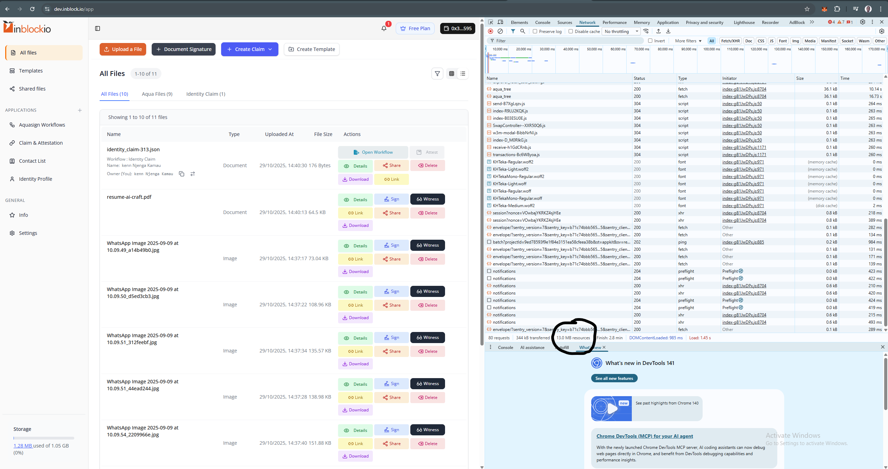
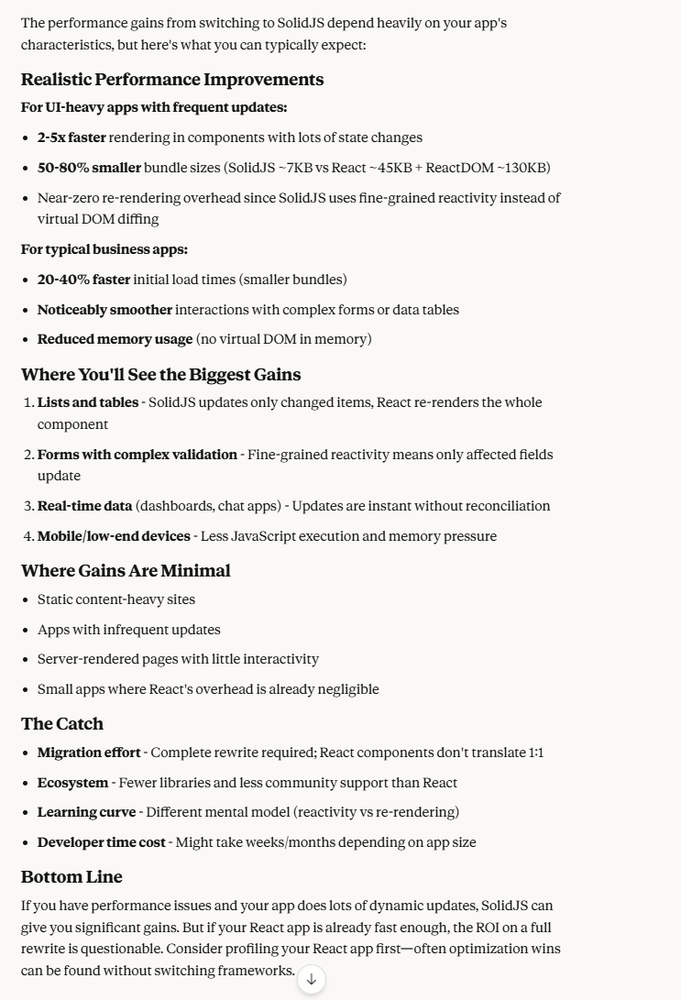
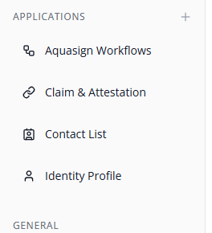

# Performance Improvement Suggestions

## 1. DNS Claim verification caching

We could improve performance of dns claim verification by caching the result of the verification for a given dns claim. This way, we only request for verification when a given period ellapses otherwise load the verification and verification status right from the db.

```typescript
    // Db Entry
    {
        domain: "example.com",
        walletAddress: "0xFeDc67e69ABa2310...",
        verificationStatus: "verified",
        verificationLogs: [],
        verificationTimestamp: "2025-10-30T17:49:52-03:00", // When the verification was done. Will be updated when the verification is re-requested
    }
```

In the function that requests for verification, we should check if the verification is already cached and if it is, we should return it. If it is not, we should request for verification and cache it.


### 2. We are sending a large bundle size to the client

A website's initial JavaScript bundle size, after minification and compression (gzipped), should ideally be under 300 KB, and smaller is always better. Anything in the megabyte (MB) range for the initial load is generally considered detrimental to performance and user experience. 

Pro and cons of using solid js 

Solid Js is most perfomant framework that very close to React unlike vue, svelte  

### 3. Cache workflows 
All Items under application section  depend on workflows this can be cached either on the front end or the backend .


### 4. Add children to revisions

Add a `string[]` for revision children to enable forward navigation to the next revision.

With `previous` field, we can navigate backwards, but if you want to query just a given ID (Identity claim) ie `dns_claim` without querying everything first then this strategy can help move that way.

Templates -> Rev ID

Search <Template ID> type DNS

[Template] -------Link/Rev----> [LinkRev] ----X----> [Srvg]
    |               ^
    |               |
    |               |
    V               |
[genesis] ----------

-> child

Update children whenever
    - New revision is created
      - Get the previous revision hash and query the revision for update for the user
    - A Revision is deleted.
      - Remove this revision's hash from the previous revision if it exists(Previos not genesis)

This strategy can help query specific claims improving the performance of the application.
ie Scan db for all ID types
- DNS
- Name
- Sig ... go to latest
    => verify
